import { Steps } from "@astrojs/starlight/components";

## Creating your Application

:::note
If you already have a Discord Application, you can skip the creation step.
:::

To create a Discord Application, you will have to follow these steps:

<Steps>

1. Go to [Discord Developers Portal Website](https://discord.com/developers/applications)

2. Click on the `New Application` button, name your application, accept the Developer Terms of Service and click on the `Create` button

   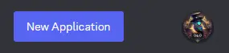
   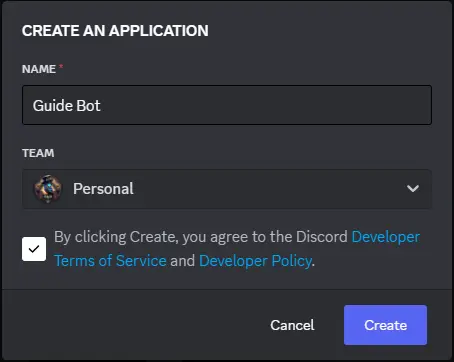

3. **(OPTIONAL)** You can add an avatar and an about me to your application

   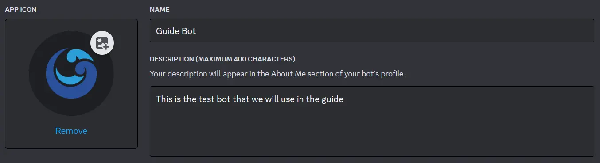

4. Click on the `Bot` button and click on the `Reset Token` button

   :::danger
   The bot token is a very important credential that must be kept private. **DO NOT** share it with other users and must be kept private and secure
   :::

   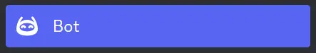
   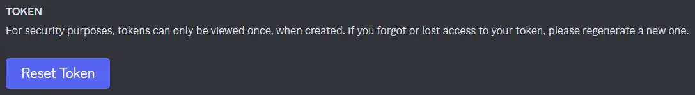
   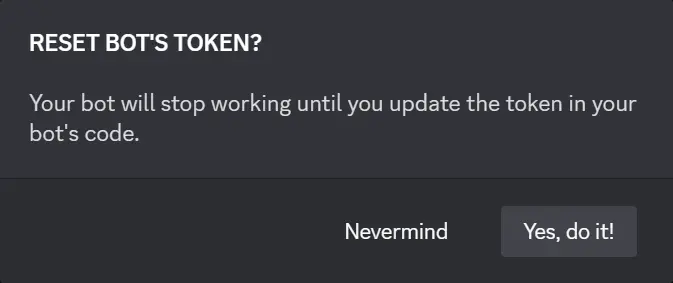

5. Finally, click on the `Copy` button

   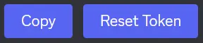

</Steps>

:::tip
If you want your Application to be added only by you, you can disable the `Public Bot` option in the `Bot` section.

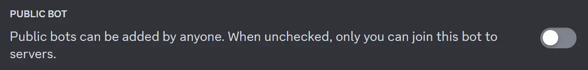

:::

## Token Importance

The token is the credential on which **the bot uses to authorize into Discord and perform requests**.

The token is a very sensitive credential that must be kept private and secure.

:::danger
If the token has been leaked, you should go as quickly as possible to the Discord Developer Portal to reset the token, making the current token invalid.

Be sure to replace the old token with the new one.
:::

## Adding your Application

:::note
If you already have your Discord Application on your server, you can skip the add to server step.
:::

To add your Discord Application to your server, you will have to follow these steps:

<Steps>

1. Click on the `OAuth2` button and go below to `OAuth2 URL Generator`

   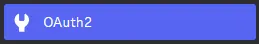
   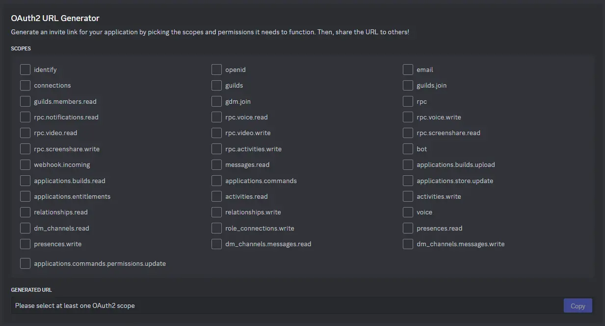

2. Select the `Bot` Scope and select the following permissions

   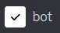

   :::caution
   You can add the `Administrator` permission directly, but it can be dangerous.
   :::

   ```txt title="Secure permissions for your bot" frame="terminal"
   Read Messages/View Channels
   Send Messages
   Embed Links
   Attach Files
   Read Message History
   ```

   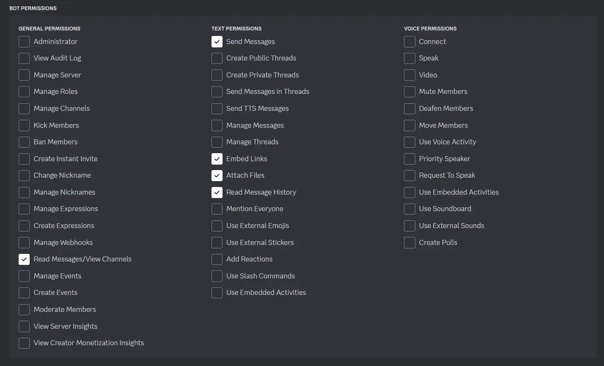

3. Finally, go below to `Generated URL`, click on the `Copy` button and add your Application to your server

   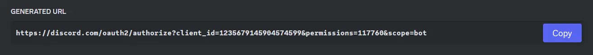

</Steps>

With all this, you now have created your Application and added it to your server.
