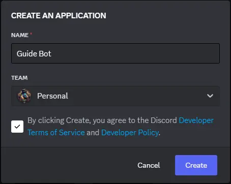
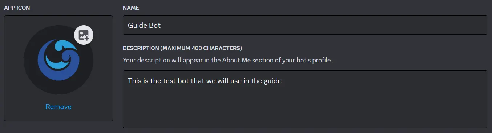
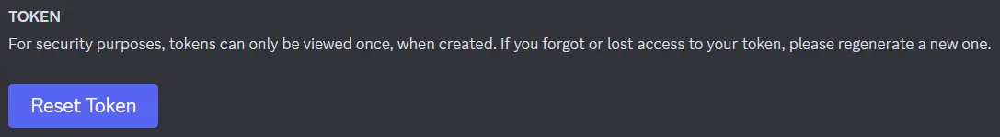
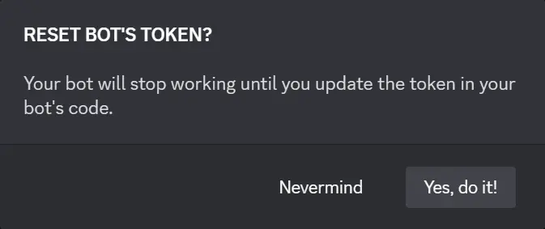
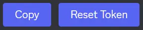
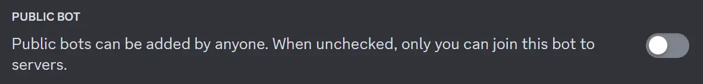
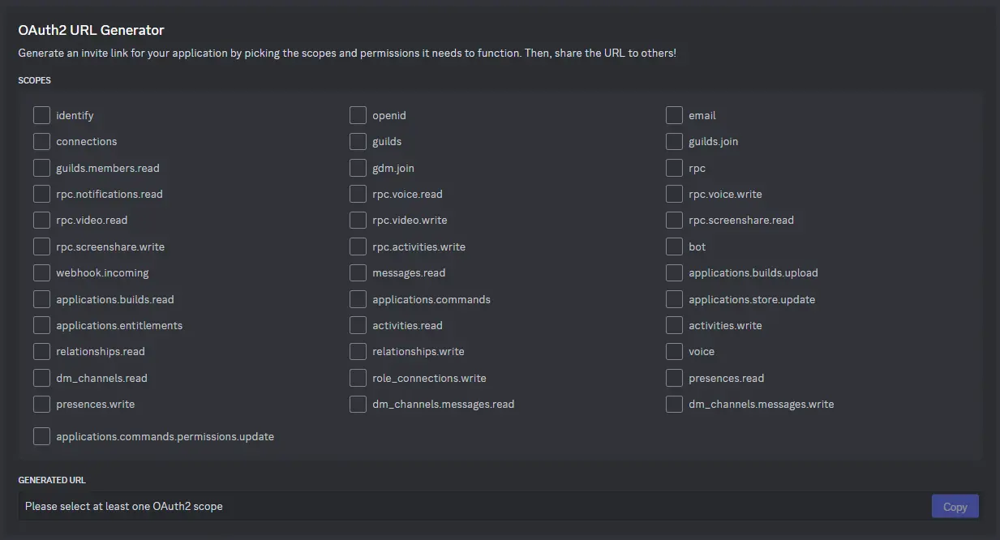
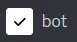
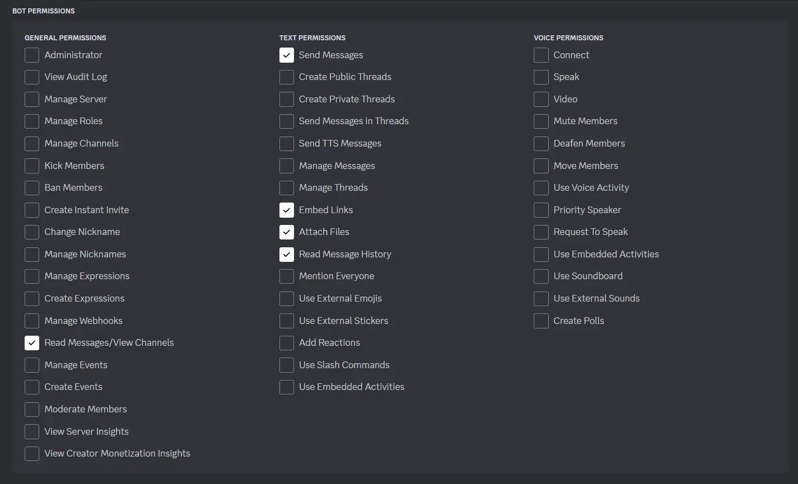
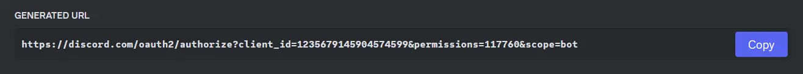

import { Steps } from "@astrojs/starlight/components";

## Creando tu Aplicación

:::note
Si ya tienes una Aplicación de Discord, puedes omitir el paso de creación.
:::

Para crear una Aplicación de Discord, tendrás que seguir estos pasos:

<Steps>

1. Ve al <a href="https://discord.com/developers/applications" target="_blank">Sitio Web del Portal de Desarrolladores de Discord</a>

2. Haz clic en el botón `Nueva Aplicación`, nombra tu aplicación, acepta los Términos de Servicio para Desarrolladores y haz clic en el botón `Crear`

   
   

3. **(OPCIONAL)** Puedes agregar un avatar y una descripción a tu aplicación

   

4. Haz clic en el botón `Bot` y luego en el botón `Restablecer Token`

   :::danger
   El token del bot es una credencial muy importante que debe mantenerse privada. **NO** lo compartas con otros usuarios y debe mantenerse privada y segura.
   :::

   
   
   

5. Finalmente, haz clic en el botón `Copiar`

   

</Steps>

:::tip
Si deseas que tu Aplicación solo sea añadida por ti, puedes desactivar la opción `Bot Público` en la sección `Bot`.



:::

## Importancia del Token

El token es la credencial con la cual **el bot se autoriza en Discord y realiza solicitudes**.

El token es una credencial muy sensible que debe mantenerse privada y segura.

:::danger
Si el token se ha filtrado, debes ir lo más rápido posible al Portal de Desarrolladores de Discord para restablecer el token, haciendo que el token actual sea inválido.

Asegúrate de reemplazar el antiguo token por el nuevo.
:::

## Añadiendo tu Aplicación

:::note
Si ya tienes tu Aplicación de Discord en tu servidor, puedes omitir el paso de agregar al servidor.
:::

Para añadir tu Aplicación de Discord a tu servidor, tendrás que seguir estos pasos:

<Steps>

1. Haz clic en el botón `OAuth2` y ve abajo a `Generador de URL de OAuth2`

   
   

2. Selecciona el Alcance `Bot` y selecciona los siguientes permisos

   

   :::caution
   Puedes agregar el permiso `Administrador` directamente, pero puede ser peligroso.
   :::

   ```txt title="Permisos seguros para tu bot" frame="terminal"
   Leer Mensajes/Ver Canales
   Enviar Mensajes
   Insertar Enlaces
   Adjuntar Archivos
   Leer Historial de Mensajes
   ```

   

3. Finalmente, ve abajo a `URL Generada`, haz clic en el botón `Copiar` y añade tu Aplicación a tu servidor

   

</Steps>

Con todo esto, ahora has creado tu Aplicación y la has añadido a tu servidor.
