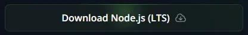
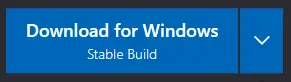

import { Steps, FileTree } from "@astrojs/starlight/components";

## Instalando Node.js

:::caution
Oceanic.js requiere la versión `18.13.0` o superior de Node.js.
:::

:::note
Si ya tienes Node.js con una versión compatible, puedes omitir el paso de instalación.

```bash title="Comprobando tu versión de Node.js" frame="terminal"
node -v # Salida: v20.13.1 (Depende de tu versión de Node.js)
```

:::

Para instalar Node.js, tendrás que seguir estos pasos:

<Steps>

1. Ve al <a href="https://nodejs.org/" target="_blank">Sitio Web de Node.js</a>

2. Haz clic en el botón `Descargar Node.js (LTS)`

   

3. Sigue las instrucciones del instalador de Node.js

4. **(OPCIONAL)** Si tienes una terminal abierta, reiníciala y ejecuta el comando `node -v` para comprobar que Node.js se ha instalado con una versión compatible

</Steps>

## Instalación de un Editor de Código

:::note
Si ya tienes un Editor de Código, puedes omitir el paso de instalación.
:::

Para instalar un Editor de Código, tendrás que seguir estos pasos:

<Steps>

1. Ve al <a href="https://code.visualstudio.com/" target="_blank">Sitio Web de Visual Studio Code</a>

2. Haz clic en el botón `Descargar para Windows`

   

3. Sigue las instrucciones del instalador de Visual Studio Code

</Steps>

## Creación del Proyecto

Para crear tu bot, tendrás que crear una nueva carpeta llamada `discord-bot` (o cualquier otro nombre) en tu Escritorio.

<FileTree>
- Desktop
  - **discord-bot/**

</FileTree>

## Configurando tu Proyecto

Una vez que hayas creado la carpeta, tendrás que abrir la carpeta con tu Editor de Código.

Para empezar a configurar el proyecto, tendrás que inicializar el archivo `package.json`.

:::note
El comando npm viene por defecto cuando instalas Node.js.
:::

```bash title="Inicializando el archivo package.json" frame="terminal"
npm init -y # Esto creará un nuevo archivo llamado package.json
```

<FileTree>

- discord-bot
  - **package.json**

</FileTree>

Puedes aprender más sobre el archivo `package.json` en la <a href="https://docs.npmjs.com/cli/v10/configuring-npm/package-json" target="_blank">Documentación de NPM.</a>

## Instalando Oceanic.js

Una vez que hayas inicializado el archivo `package.json`, tendrás que instalar `oceanic.js`.

```bash title="Instalando Oceanic.js" frame="terminal" "sin API de Voz"
# Soporte sin API de Voz
npm install oceanic.js --omit=optional

# Soporte con API de Voz
npm install oceanic.js --include=optional
```

Una vez que hayas instalado `oceanic.js`, se creará un nuevo archivo llamado `package-lock.json` y una nueva carpeta llamada `node_modules`.

<FileTree>

- discord-bot
  - **node_modules/**
  - **package-lock.json**
  - package.json

</FileTree>
