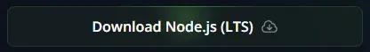
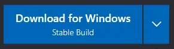

import { Steps, FileTree } from "@astrojs/starlight/components";

## Installing Node.js

:::caution
Oceanic.js requires Node.js version `18.13.0` or `higher`.
:::

:::note
If you already have Node.js with a compatible version, you can skip the installation step.

```bash title="Checking your Node.js version" frame="terminal"
node -v # Output: v20.13.1 (Depends on your Node.js version)
```

:::

To install Node.js, you will have to follow these steps:

<Steps>

1. Go to <a href="https://nodejs.org/" target="_blank">Node.js Website</a>

2. Click on the `Download Node.js (LTS)` button

   

3. Follow the instructions of the Node.js installer

4. **(OPTIONAL)** If you have a terminal open, restart it and execute the `node -v` command to check that Node.js has been installed with a compatible version

</Steps>

## Installing a Code Editor

:::note
If you already have a Code Editor, you can skip the installation step.
:::

To install a Code Editor, you will have to follow these steps:

<Steps>

1. Go to <a href="https://code.visualstudio.com/" target="_blank">Visual Studio Code Website</a>

2. Click on the `Download for Windows` button

   

3. Follow the instructions of the Visual Studio Code installer

</Steps>

## Creating the Project

To create your bot, you will have to create a new folder named `discord-bot` (or another name) on your Desktop.

<FileTree>
- Desktop
  - **discord-bot/**

</FileTree>

## Configuring your Project

Once you have created the folder, you will have to open the folder with your Code Editor.

To start setting up the project, you will have to initialize the `package.json` file.

:::note
The npm command comes by default when you install Node.js.
:::

```bash title="Initializing the package.json file" frame="terminal"
npm init -y # This will create a new file named package.json
```

<FileTree>

- discord-bot
  - **package.json**

</FileTree>

You can learn more about the `package.json` file in the <a href="https://docs.npmjs.com/cli/v10/configuring-npm/package-json" target="_blank">NPM Documentation.</a>

## Installing Oceanic.js

Once you have the `package.json` file initialized, you will have to install `oceanic.js`.

```bash title="Installing Oceanic.js" frame="terminal" "No Voice"
# No Voice API support
npm install oceanic.js --omit=optional

# Voice API support
npm install oceanic.js --include=optional
```

Once you have installed `oceanic.js`, a new file named `package-lock.json` and a new folder named `node_modules` will be created.

<FileTree>

- discord-bot
  - **node_modules/**
  - **package-lock.json**
  - package.json

</FileTree>
